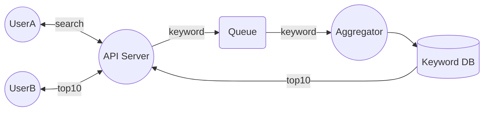

## 개발환경

-   IDE : IntelliJ
-   JAVA : java17 (openjdk-17.0.2)
-   빌드 : maven 3.8.1
-   Springboot : 2.7.0
-   테스트 : Junit 5

## 외부 라이브러리

-   h2 database 2.1.210: 키워드 검색 정보 저장용 데이터베이스
-   Lombok 1.18.22 / Mapstruct 1.4.2: 코드 간소화 및 Entity <-> Dto 매핑 간소화
-   ActiveMQ 5.16.4 : 키워드 검색 수 합산을 위한 데이터 전달 브로커


## 시스템 다이어그램



## 요구사항 구현 설명
### 검색결과 합산 방식
 장소명에서 공백 및 태그를 제거하여 비교하였습니다. 이때, 응답으로 전달되는 장소명은 우선순위가 높은 검색서비스(기본 : 카카오)의 데이터를 사용하였습니다. 향후 다른 외부 API 가 추가되는 경우에도 동일하게 적용됩니다. 

### 동시성 제어
 REST 서비스와 인기 키워드 검색횟수를 수집하는 서비스(KeywordAggregator) 를 분리하였습니다. REST서비스는 검색결과의 제공을 하며, 메시지 큐를 통해 키워드를 KeywordAggregator 에게 전달하게 됩니다. KeywordAggregator가 메시지 큐로부터 키워드를 차례로 공급받아 순차적으로 키워드 갯수를 데이터베이스에 업데이트하는 방식 입니다. 만일 여러대의 노드에서 KeywordAggregator가 동시에 같은 컬럼에 엑세스 하려는 경우에 대비해 row lock 을 사용하였으며 lock에 의해 배제된 트랜잭션의 경우, 메시지 큐의 맨 뒤로 다시 들어가 이후에 재시도를 하게 됩니다.
 
### API 제공자의 장애 대비
 API제공자의 장애를 우선 2가지 경우로 생각하였습니다. 1) 응답이 늦는 경우 2) 응답 오류가 발생하는 경우 입니다. 1)의 경우는 대부분 제공자가 제대로 된 응답을 주지 못하는 상황일 가능성이 크기 때문에, 커넥션 및 응답 시간을 프로퍼티로 지정할 수 있도록 하여 일정 시간이 넘으면 오류상태를 호출자에게 전달하도록 하였습니다. 2) 의 경우도 마찬가지로 내부 오류 상황을 호출자에게 전달 하도록 구성하였습니다.

### 새로운 API 제공자 대비
 ApiVendorProvider 클래스에 등록된 API 제공자들을 통해 검색을 진행하게 됩니다. 모두 동일한 인터페이스를 구현해야 하며 도메인 내부로부터 호출되는 방식이므로 제공자에 따른 하드코드 양을 최대한 줄이고자 노력하였습니다. 구글 API 를 추가한다고 가정하였을 때, 해당 API 호출방식에 맞게 검색 인터페이스를 구현하고 ApiVendorProvider 클래스에 등록해주면 동작이 가능합니다.
 
```
private final static Class[] apiVendors = {  
    KakaoSearchApi.class,  
    NaverSearchApi.class  
};

public abstract class SearchRequest {  
    public abstract VendorSearchResult request(String keyword);  
    protected abstract String buildRequestUri(String keyword);  
}
```
또한 검색 결과를 합산해주는 부분은 별도로 존재하므로 새로운 API 제공자 추가시에 별도의 작업이 필요치 않으며 application.properties 파일을 통해 우선순위를 설정해주면 합산은 정상적으로 이루어 질것입니다.
```	
api.kakao.vendorName=KAKAO  
api.kakao.restApiKey={VALUE}  
api.kakao.priority=0  
api.naver.vendorName=NAVER  
api.naver.clientSecret={VALUE}  
api.naver.clientId={VALUE}  
api.naver.priority=1
```
### 서비스 오류 및 장애 처리 방법
 연동 API 의 오류 또는 스펙 변경등의 상황이 발생하였을때에는 미리 정의된 오류상황을 호출자에게 전달하였습니다. 또한 키워드 검색 수 제공의 경우, 메시지 브로커를 노드 내부가 아닌 공용으로 사용하고 여러대의 노드에 서비스를 띄운다면 특정 노드의 장애에도 문제없이 서비스를 지속할 수 있을거라고 생각합니다. 만일 합산 서비스에 장애가 생긴다 하더라도 API 서비스는 독립적으로 동작하므로 정상 서비스가 가능합니다.

### 트래픽 처리
 한꺼번에 많은 검색 요청이 들어왔을때에도 Write 작업은 메시지 큐를 통해 KeywordAggregator에게 전달되므로 데이터베이스의 부하를 최소화 하도록 하였습니다.
### 지속성 및 확장성 있는 아키텍처
 엔티티와 유즈케이스가 인터페이스를 통해 실제 구현체를 호출하는 구조로서 외부 API 제공자의 스펙 변경이나 추가에도 대응이 용이하도록 구현하였습니다. 메시지큐 구현체 변경이나 API 변경/추가 등의 작업은 adapter 패키지 내부에서 해결될 수 있도록 노력하였습니다.

### 기타
 잘못된 url접근 혹은 파라미터 미입력, 예기치 못한 내부오류 등에 대해서 적절한 응답을 받을 수 있도록 구현하였습니다.

## 주요 폴더 구조 설명

```
    main/.../placesearch
    ├── adapter
	│   ├── aggregation # 메시지 브로커와 검색 순위 합산 구현체
	│   ├── apiprovider # 카카오, 네이버 등 실제 검색제공자 모음
	│   ├── controller  # REST 서비스에 필요한 DTO, 컨트롤러, 응답 포맷 등
	│   ├── repository  # 키워드 검색 수 저장에 필요한 저장소 구현체
    ├── domain
    │   ├── entitity    # 핵심 데이터 타입 및 검색 로직 정의
    │   ├── port        # 서비스 구동에 필요한 외부 주입 요소들
    ├── service         # 검색결과/키워드 합산 서비스
    ├── usecase         # 검색 유즈케이스 및 결과 전달용 DTO
    test                # 테스트 코드
```

## 실행 및 테스트
##### Intellij Run configuration
* Placesearch : 어플리케이션 실행
* All Test : 유닛 테스트 실행 (검색결과의 합산 및 각 api 제공사의 응답 검증용 테스트 입니다.)

#### build in commandline
```
# mvn package 
# java --jar target/placesearch-0.0.1-SNAPSHOT.jar.original
```

##### 장소 검색

```
# curl -G --data-urlencode "q=카카오뱅크" http://localhost:8080/v1/place
# curl -G --data-urlencode "q=신촌설렁탕" http://localhost:8080/v1/place
```
> 브라우저 주소창 입력 예 : http://localhost:8080/v1/place?q=마포

##### 인기 키워드 검색

```
# curl -G http://localhost:8080/v1/place/popularkeywords
```


#### 도커 실행
```
# docker build . -t placesearch
# docker run -p 8080:8080 placesearch
```
## 응답 포맷
### 장소 검색
```
{
	status: 0,
	kind: "placesearch",
	data: [
		{
			name: {장소명}
		}
		...
	]
}
```
### 검색어 순위
```
{
	status: 0,
	kind: "popularkeywords",
	data: [
		{
			name:	{검색어},
			count:	{횟수}
		}
		...
	]
}
```
### 오류
```
{
    status: 상태코드(0: 정상, -1: 파라미터 오류, -2: 잘못된 url, -3: 내부 오류)
    kind: "error"
    data: {오류메시지}
}
```
